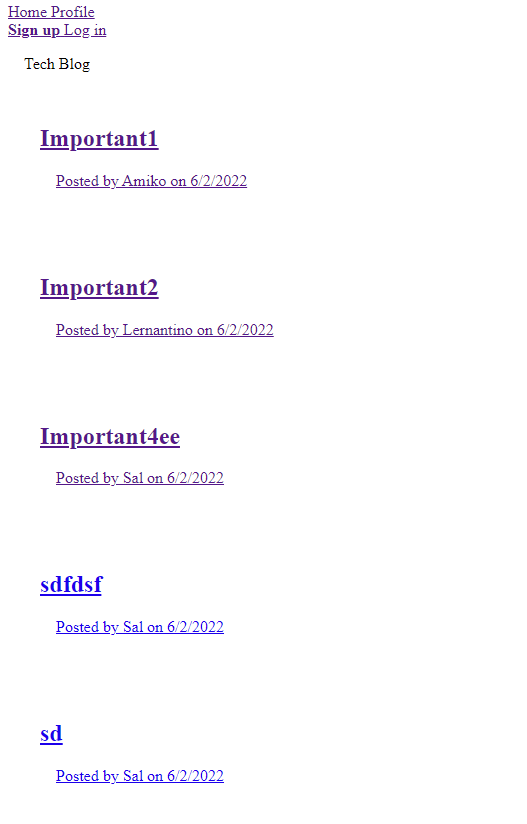
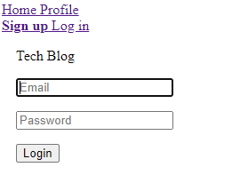
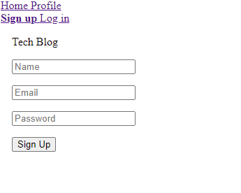
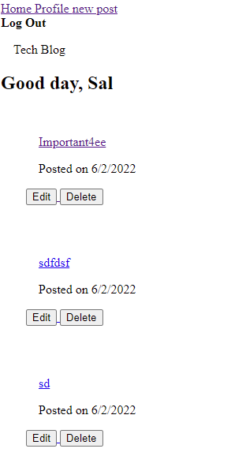
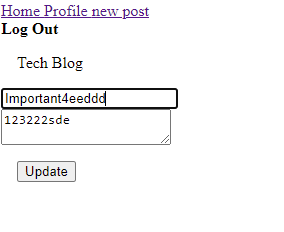
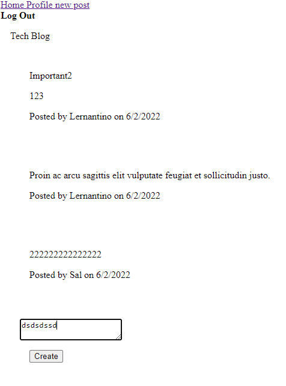

# Tech Blog
This is an interactive blog for users to put in the information they want and interact with each other.

## Table Of Contents 
 - [usage](#usage)
 - [installation](#installation)
 - [technologies used](#technologies-used)
 - [license](#license)

 ## Usage
 I spent long time working on deploying the application to Heroku, but it was giving me an error. 
 Running the app in the local environment will direct to the full usage of the app.

Here are some screenshots of the functions
```md 
Home page:
```



```md 
Login page:
```



```md 
 Signup Page:
 ```



```md 
Profile Page: user will see what posts he/she has posted
```



```md 
 Edit function: user can edit his/her posts (delete works as well!)
 ```



```md 
Comment function: users can interact with each other as well, by commenting
```



## Installation
 Steps are as follows: 
 * npm i
 * npm start
 

## Technologies Used
* HTML
* CSS
* JavaScript
* Handlebars
* Node.js
* npm
* Mysql
* Sequelize

## License
 This application is covererd under MIT. Click the badge to learn more. 

 [](https://opensource.org/licenses/MIT)

